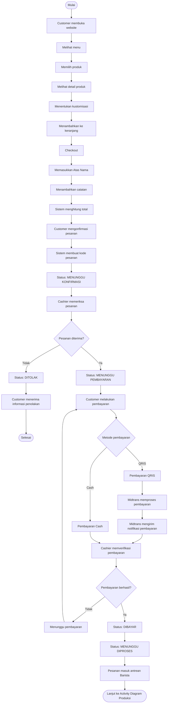
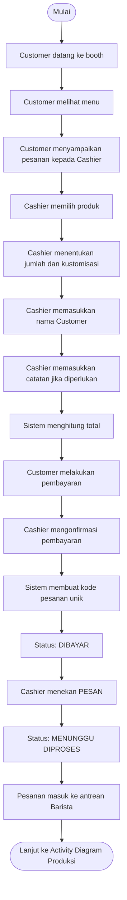
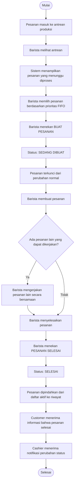
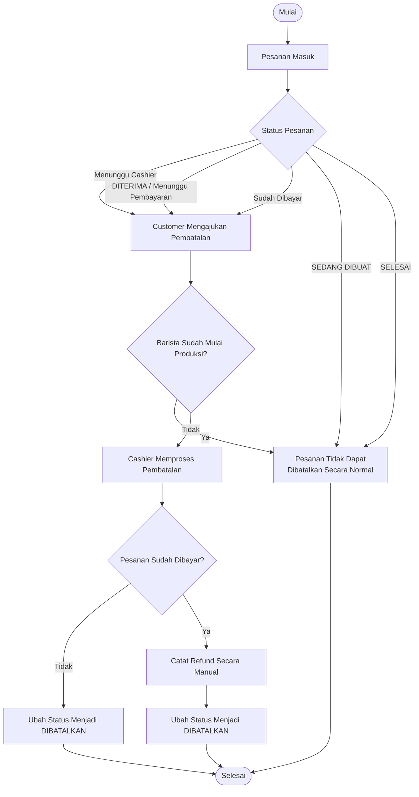
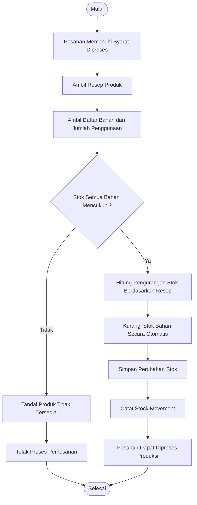

# Activity Diagram - Theodore Coffee V1

## 1. Gambaran Umum

Activity Diagram digunakan untuk menggambarkan alur aktivitas yang terjadi
dalam sistem Theodore Coffee V1, mulai dari pelanggan melakukan pemesanan,
proses penerimaan pesanan oleh Cashier, pembayaran, produksi oleh Barista,
hingga pesanan selesai.

Diagram aktivitas dibagi berdasarkan proses utama agar alur sistem lebih
mudah dipahami dan tidak terlalu kompleks dalam satu diagram.

---

# 2. Activity Diagram Pemesanan Online

## 2.1 Deskripsi

Activity Diagram Pemesanan Online menggambarkan proses ketika Customer
melakukan pemesanan melalui website Theodore Coffee.

Customer tidak perlu membuat akun. Customer cukup mengakses website,
memilih menu, menentukan kustomisasi, memasukkan nama pemesan, kemudian
melakukan konfirmasi pesanan.

Pesanan yang telah dikonfirmasi akan masuk ke Cashier untuk diterima atau
ditolak. Pesanan yang diterima akan dilanjutkan ke proses pembayaran.

## 2.2 Alur Aktivitas

1. Customer membuka website Theodore Coffee.
2. Customer melihat daftar menu.
3. Customer memilih produk.
4. Sistem menampilkan detail produk.
5. Customer menentukan kustomisasi.
6. Customer memasukkan produk ke keranjang.
7. Customer melakukan checkout.
8. Sistem meminta nama pemesan.
9. Customer mengisi nama pemesan.
10. Customer menambahkan catatan jika diperlukan.
11. Sistem menghitung total pesanan.
12. Customer melakukan konfirmasi pesanan.
13. Sistem membuat pesanan dengan kode pesanan unik.
14. Pesanan masuk ke Cashier dengan status `MENUNGGU KONFIRMASI`.
15. Cashier memeriksa pesanan.
16. Cashier menentukan apakah pesanan diterima atau ditolak.

### Jika ditolak

17. Sistem mengubah status pesanan menjadi `DITOLAK`.
18. Customer menerima informasi bahwa pesanan ditolak.
19. Proses selesai.

### Jika diterima

17. Sistem mengubah status pesanan menjadi `MENUNGGU PEMBAYARAN`.
18. Customer melakukan pembayaran.
19. Sistem memproses pembayaran.
20. Jika pembayaran QRIS digunakan, Midtrans memproses pembayaran dan
    mengirimkan notifikasi pembayaran.
21. Cashier melakukan verifikasi pembayaran.
22. Jika pembayaran berhasil diverifikasi, status berubah menjadi `DIBAYAR`.
23. Pesanan masuk ke proses produksi.
24. Sistem mengubah status menjadi `MENUNGGU DIPROSES`.
25. Pesanan masuk ke antrean Barista.

## 2.3 Diagram Mermaid

# 3. Activity Diagram Pemesanan Offline

## 3.1 Deskripsi

Activity Diagram Pemesanan Offline menggambarkan proses ketika Customer
melakukan pemesanan secara langsung di booth Theodore Coffee melalui
Cashier.

Customer menyampaikan pesanan kepada Cashier. Cashier memasukkan data
pesanan, menentukan kustomisasi, menghitung total, menerima pembayaran,
kemudian mengonfirmasi pesanan untuk masuk ke proses produksi.

## 3.2 Alur Aktivitas

1. Customer datang ke booth.
2. Customer melihat menu.
3. Customer menyampaikan pesanan kepada Cashier.
4. Cashier memilih produk.
5. Cashier menentukan jumlah dan kustomisasi.
6. Cashier memasukkan nama Customer.
7. Cashier memasukkan catatan jika diperlukan.
8. Sistem menghitung total.
9. Customer melakukan pembayaran.
10. Cashier mengonfirmasi pembayaran.
11. Sistem membuat kode pesanan unik.
12. Sistem mengubah status pesanan menjadi `DIBAYAR`.
13. Cashier menekan `PESAN`.
14. Sistem mengubah status menjadi `MENUNGGU DIPROSES`.
15. Pesanan masuk ke antrean Barista.

## 3.3 Diagram Mermaid

## 4.3 Diagram Mermaid
# 4. Activity Diagram Produksi Pesanan

## 4.1 Deskripsi

Activity Diagram Produksi menggambarkan proses setelah pesanan memenuhi
 syarat untuk diproduksi dan masuk ke antrean Barista.

Barista dapat mengerjakan beberapa pesanan secara bersamaan. Tidak terdapat
 batas maksimum jumlah pesanan aktif yang dapat dikerjakan oleh Barista.

Prioritas untuk memulai produksi tetap mengikuti antrean FIFO.

## 4.2 Alur Aktivitas

1.  Pesanan masuk ke antrean produksi. 
2.  Barista melihat antrean. 
3.  Sistem menampilkan pesanan yang menunggu diproses. 
4.  Barista memilih pesanan berdasarkan prioritas antrean. 
5.  Barista menekan `BUAT PESANAN`. 
6.  Sistem mengubah status menjadi `SEDANG DIBUAT`. 
7.  Pesanan terkunci dari perubahan normal. 
8.  Barista membuat pesanan. 
9.  Barista dapat mengerjakan pesanan lain secara bersamaan. 
10.  Barista menyelesaikan pesanan. 
11.  Barista menekan `PESANAN SELESAI`. 
12.  Sistem mengubah status menjadi `SELESAI`. 
13.  Pesanan dipindahkan dari daftar aktif ke riwayat. 
14.  Customer menerima informasi bahwa pesanan selesai. 
15.  Cashier menerima notifikasi perubahan status.

# 5. Activity Diagram Pembatalan Pesanan

## 5.1 Deskripsi

Pembatalan pesanan dapat dilakukan sebelum Barista memulai proses produksi.

Pesanan yang masih berada pada tahap sebelum `SEDANG DIBUAT` dapat dibatalkan
sesuai dengan kondisi dan hak akses yang berlaku.

Pesanan yang sudah berada pada status `SEDANG DIBUAT` tidak dapat dibatalkan
melalui alur pembatalan normal karena proses produksi telah dimulai.

Untuk pesanan yang sudah dibayar, pembatalan memerlukan pencatatan refund
secara manual oleh pihak yang berwenang.

## 5.2 Diagram Aktivitas

### Versi yang lebih sesuai dengan aturan Theodore Coffee

Karena di Theodore Coffee **setiap pesanan online harus melewati Cashier terlebih dahulu**, sebenarnya diagramnya lebih bagus kalau dibuat berdasarkan **status pesanan**, bukan hanya "sudah dibayar atau belum".

5.3 Alur Proses
1. Customer membuat pesanan.
2. Sistem memeriksa apakah pesanan sudah dibayar.
3. Sistem memeriksa apakah Barista sudah memulai produksi.
4. Jika Barista belum memulai produksi, pembatalan dapat diajukan.
5. Jika pembatalan tidak disetujui, pesanan tetap berjalan.
6. Jika pembatalan disetujui:
- Jika pesanan belum dibayar, pesanan langsung dibatalkan.
- Jika pesanan sudah dibayar, dilakukan pencatatan refund secara manual.
7. Jika Barista sudah berada pada status SEDANG DIBUAT, pesanan tidak dapat
    dibatalkan melalui alur pembatalan normal.
8.  Proses selesai.

# 6. Activity Diagram Pengelolaan Stok Otomatis
## 6.1 Deskripsi

Stok bahan baku dikelola berdasarkan resep produk. Setiap produk memiliki
resep yang menentukan bahan dan jumlah yang digunakan.

Ketika transaksi berhasil dan pesanan memenuhi syarat untuk diproses,
sistem melakukan pengurangan stok berdasarkan resep secara otomatis.

Jika stok tidak mencukupi, produk dapat dinyatakan tidak tersedia dan sistem
menolak proses pemesanan.

## 6.2 Diagram Mermaid

# 7. Catatan Activity Diagram

Beberapa aturan utama yang harus tetap diterapkan pada seluruh activity
diagram:

- Customer tidak perlu login atau membuat akun.
- Customer menggunakan Atas Nama pada pesanan.
- Semua pesanan yang akan diproduksi harus melalui Cashier.
- Customer tidak dapat mengirim pesanan langsung ke Barista.
- Pesanan online harus diterima Cashier sebelum pembayaran dilanjutkan.
- Pembayaran QRIS menggunakan Midtrans.
- Status pembayaran QRIS harus diverifikasi sebelum pesanan masuk produksi.
- Pesanan yang sudah SEDANG DIBUAT terkunci dari perubahan normal.
- Barista dapat mengerjakan beberapa pesanan secara bersamaan.
- Tidak ada batas maksimum pesanan aktif pada Barista.
- FIFO digunakan sebagai prinsip prioritas memulai produksi.
- Cashier dan Admin/Owner dapat membuat atau mencetak ulang struk PDF.
- Customer dan Barista tidak memiliki fitur struk.
- Pengurangan stok dilakukan berdasarkan resep.
- Pengurangan stok dan pencatatan stock movement harus dilakukan secara
- konsisten dalam satu proses transaksi.