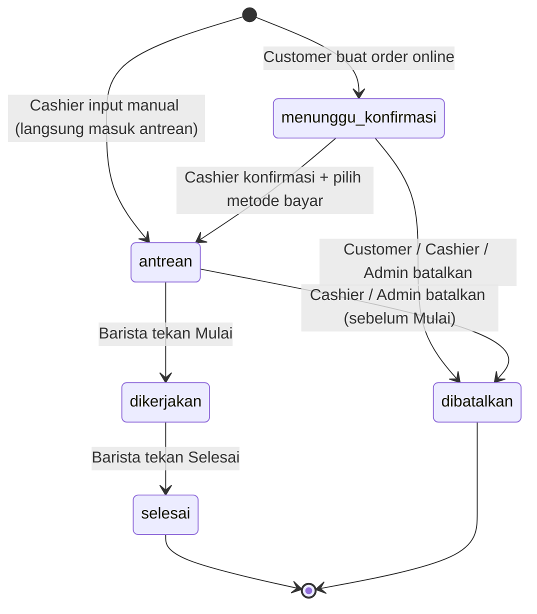

# Alur Order — Theodore Coffee V1

Terkait: `prd.md`, `data-model.md`, `permissions.md`.

## 1. Status order

| Status (sistem) | Tampil ke customer | Artinya |
|---|---|---|
| `menunggu_konfirmasi` | Menunggu konfirmasi | Order tersimpan, belum dikonfirmasi Cashier. Belum terlihat Barista. |
| `antrean` | Sedang dibuat | Sudah dikonfirmasi dan dibayar. Muncul di layar Barista sebagai order baru dengan tombol **Mulai**. |
| `dikerjakan` | Sedang dibuat | Barista sudah menekan Mulai. Tombol berubah menjadi **Selesai**. |
| `selesai` | Pesanan selesai | Barista menekan Selesai. Status akhir. |
| `dibatalkan` | Dibatalkan | Dibatalkan sebelum Barista menekan Mulai. Status akhir. |

## 2. Diagram

## 3. Perpindahan status

| Dari | Ke | Aksi | Siapa | Efek |
|---|---|---|---|---|
| (baru) | menunggu_konfirmasi | Buat order online | Customer (HP) | Order tersimpan, dapat nomor antrean, notifikasi muncul di Cashier |
| (baru) | antrean | Input order manual + pilih metode bayar + Simpan | Cashier (atau Admin) | **Tanpa tahap Menunggu konfirmasi.** Order, pembayaran, dan pengurangan stok* tersimpan dalam satu transaksi, lalu order muncul di layar Barista |
| menunggu_konfirmasi | antrean | Konfirmasi + pilih metode bayar (QRIS/tunai) | Cashier (atau Admin) | Pembayaran dicatat, stok berkurang*, order muncul di layar Barista dengan tombol Mulai |
| menunggu_konfirmasi | dibatalkan | Batalkan (customer lewat popup Ya/Tidak) | Customer, Cashier, Admin | Order tidak masuk antrean, tidak ada pembayaran dan stok yang tercatat |
| antrean | dibatalkan | Batalkan | Cashier, Admin | Pembayaran dibatalkan (void), stok dikembalikan, order keluar dari antrean Barista. Satu transaksi, semuanya tercatat di log |
| antrean | dikerjakan | Mulai | Barista | Tombol berubah menjadi Selesai. Status di HP customer tetap Sedang dibuat |
| dikerjakan | selesai | Selesai | Barista | Status customer online berubah menjadi Pesanan selesai, customer offline dipanggil langsung |

Tidak ada perpindahan lain. Order tidak bisa dibatalkan lagi setelah Barista menekan Mulai. Order `selesai` dan `dibatalkan` tidak bisa diubah lagi.

\* Stok berkurang saat konfirmasi (bukan saat order dibuat), supaya pembatalan tidak perlu mengembalikan stok.

## 4. Dua jalur masuk

**Online:** customer scan QR booth → pesan dan isi nama → status Menunggu konfirmasi → bayar di booth → Cashier menerima notifikasi, cek bayar, Konfirmasi.

**Kasir:** customer datang → Cashier input order → customer bayar → Cashier memilih metode bayar dan menekan Simpan. Order **langsung masuk antrean**, tanpa tahap Menunggu konfirmasi karena Cashier sendiri yang membuat dan menerima pembayarannya. Sebelum Simpan, layar menampilkan ringkasan pesanan untuk dicek ulang.

Keduanya memakai alur dan antrean yang sama. Antrean Barista diurutkan berdasarkan waktu konfirmasi.

## 5. Kasus tepi

- **Batalkan dan Konfirmasi bersamaan:** server mengecek status terakhir saat aksi dijalankan. Yang masuk duluan menang, pihak lain mendapat pesan "status pesanan sudah berubah". Order yang batal sebelum konfirmasi tidak punya pembayaran atau pengurangan stok.
- **Batalkan (Cashier/Admin) dan Mulai (Barista) bersamaan:** yang masuk duluan menang. Kalau Mulai menang, pembatalan ditolak dengan pesan "status pesanan sudah berubah".
- **Klik ganda / kirim dua kali:** tidak boleh menghasilkan dua order atau dua pengurangan stok.
- **Gagal menyimpan order:** customer melihat pesan error yang jelas dan bisa mencoba lagi. Error tercatat di log.
- **Internet putus:** Cashier mencatat di kertas, lalu menginput belakangan dengan waktu manual (ditandai di order dan log). Waktu manual hanya boleh di **hari berjalan (WIB)** dan tidak di masa depan, karena laporan hari sebelumnya sudah terkunci di Riwayat. Input belakangan harus selesai sebelum pergantian hari.

## 6. Acceptance criteria

Alur dianggap selesai kalau semua poin ini lolos:

1. Order tersimpan begitu dibuat dan mendapat nomor antrean, meski belum dibayar.
2. Barista tidak melihat order berstatus `menunggu_konfirmasi` atau `dibatalkan`.
3. Cashier tidak bisa mengonfirmasi tanpa memilih metode bayar.
4. Setelah Konfirmasi, status di HP customer berubah menjadi Sedang dibuat tanpa refresh manual.
5. Setelah Barista menekan Selesai, status di HP customer berubah menjadi Pesanan selesai.
5a. Order yang baru dikonfirmasi muncul di layar Barista dengan tombol Mulai, dan tidak otomatis dianggap sedang dikerjakan.
5b. Setelah Mulai ditekan, tombol berubah menjadi Selesai, dan status di HP customer tetap Sedang dibuat.
5c. Selesai tidak bisa ditekan sebelum Mulai. Kalau dua Barista menekan Mulai pada order yang sama, satu yang menang dan yang lain mendapat pesan.
6. Tombol Batalkan untuk customer hanya muncul saat Menunggu konfirmasi dan hilang setelah konfirmasi. Cashier dan Admin masih bisa membatalkan order berstatus antrean sampai Barista menekan Mulai.
7. Popup batalkan: Tidak tidak mengubah apa pun, Ya membuat status Dibatalkan.
8. Batalkan dan Konfirmasi bersamaan menghasilkan satu pemenang, dan pihak lain mendapat pesan.
9. Order `selesai` atau `dibatalkan` tidak bisa diubah oleh siapa pun.
10. Antrean Barista berurut berdasarkan waktu konfirmasi.
11. Setiap perubahan status tercatat di log aktivitas (siapa, kapan, dari status apa ke status apa).
12. Kegagalan membuat atau mengonfirmasi order tercatat di log error dan tidak membuat data ganda.
13. Order yang diinput belakangan memakai waktu manual dan ditandai.
14. Menu yang bahannya tidak cukup untuk satu porsi tampil Habis dan tidak bisa dipesan.
15. Konfirmasi saat stok kurang tetap berhasil, menampilkan peringatan ke Cashier, dan tercatat di log.
16. Nomor antrean mulai dari 1 lagi tiap hari (WIB) dan tidak ada nomor ganda dalam satu hari.
17. Beberapa Cashier atau Barista boleh aktif bersamaan (akun berbeda, atau satu akun di dua laptop). Antrean dan status tersinkron di semua layar tanpa refresh manual. Dua Cashier yang menekan Konfirmasi pada order yang sama menghasilkan satu pemenang dan satu pembayaran, sedangkan yang kalah mendapat pesan "status pesanan sudah berubah".
18. Order yang diinput Cashier langsung berstatus `antrean` (tidak pernah `menunggu_konfirmasi`), pembayaran dan pengurangan stok tercatat, dan `order.created` serta `order.confirmed` masuk log.
19. Cashier atau Admin yang membatalkan order berstatus `antrean`: pembayaran ditandai batal, stok dikembalikan, order hilang dari layar Barista, dan `order.cancelled`, `payment.voided`, serta `stock.restored` tercatat di log.
20. Order yang sudah `dikerjakan` atau `selesai` tidak bisa dibatalkan oleh siapa pun.
21. Kartu order Menunggu konfirmasi menampilkan sisa porsi untuk tiap menu yang dipesan, dan panel sisa stok menampilkan sisa porsi per menu serta daftar sisa bahan.
22. Cashier dan Admin yang membatalkan order wajib memilih alasan (alasan `lainnya` wajib catatan 1-100 karakter), dan customer melihat "Dibatalkan karena: [alasan]" di halaman statusnya.
23. Pembatalan oleh customer sendiri tercatat dengan alasan `diminta_customer`, dan customer melihat "Dibatalkan oleh kamu".
24. Cashier, Barista, dan Admin bisa melihat sisa stok (hanya baca). Customer hanya melihat menu Habis atau tersedia.

## 7. Keputusan

1. **Stok berkurang saat konfirmasi.** Order yang dibatalkan tidak pernah menyentuh stok.
2. **Stok tidak cukup:** menu otomatis tampil **Habis** (tidak bisa dipesan) kalau bahan tidak cukup untuk satu porsi. Saat konfirmasi, kekurangan stok hanya **peringatan** ke Cashier, tidak diblokir, karena customer sudah membayar dan stok di sistem bisa selisih dengan stok fisik (takaran, tumpah). Stok boleh menjadi minus dan tercatat di log, supaya Admin bisa mengoreksinya. Kalau dua order bersaing untuk stok terakhir, Cashier yang memutuskan mana yang diterima (lihat keputusan soal indikator stok dan alasan pembatalan yang menyusul).
3. **Admin boleh mengonfirmasi order** sebagai cadangan kalau Cashier berhalangan atau laptopnya bermasalah. Tercatat di log sebagai aksi Admin.
4. **Nomor antrean mulai dari 1 lagi tiap hari** (WIB), sejalan dengan laporan harian. Identitas order di database tetap unik (ID internal), dan nomor antrean + tanggal dipakai sebagai referensi di layar.
5. **Indikator stok dan alasan pembatalan.** Cashier melihat sisa porsi per menu dan sisa bahan, dan di tiap order Menunggu konfirmasi tampil sisa porsi untuk menu yang dipesan. Kalau dua order bersaing untuk stok terakhir, Cashier menerima salah satu lalu membatalkan yang lain dengan alasan. Pilihan alasan: stok habis, pembayaran tidak diterima, diminta customer, pesanan ganda, salah input, dan lainnya (wajib catatan 1-100 karakter). Customer melihat "Dibatalkan karena: ..." (atau "Dibatalkan oleh kamu" kalau ia sendiri yang membatalkan). Sisa stok bisa dilihat semua peran staf (hanya baca). Tidak ada penolakan otomatis karena stok.