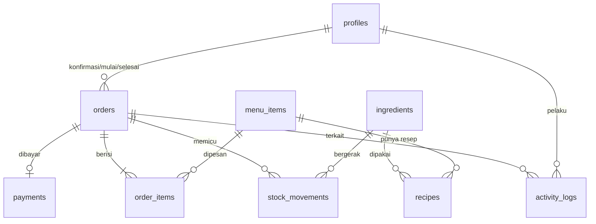

# Data Model — Theodore Coffee V1

Database: Supabase (PostgreSQL). Terkait: `prd.md`, `order-flow.md`, `permissions.md`.

## 1. ERD

Tabel tanpa relasi langsung: `queue_counters`, `daily_reports`, `error_logs`.

## 2. Tabel

Semua uang disimpan sebagai **bilangan bulat rupiah**. Semua waktu memakai `timestamptz`. "Hari" bisnis dihitung dengan zona waktu WIB.

### profiles (akun internal)
| Field | Keterangan |
|---|---|
| id | uuid, sama dengan id di `auth.users` |
| name | nama tampilan |
| role | `admin` / `cashier` / `barista` |
| is_active | akun bisa dinonaktifkan |

Customer **tidak punya akun**.

### menu_items
| Field | Keterangan |
|---|---|
| id | uuid |
| name, price | nama dan harga (rupiah) |
| is_active | disembunyikan dari menu kalau false |
| created_at, updated_at | |

Status **Habis** tidak disimpan, tapi dihitung: menu habis kalau ada bahan di resepnya yang stoknya kurang dari takaran satu porsi.

### ingredients
| Field | Keterangan |
|---|---|
| id | uuid |
| name | misal "Susu" |
| unit | `g` / `ml` / `pcs` |
| stock_qty | stok saat ini, **boleh minus** (lihat aturan 4) |

### recipes
| Field | Keterangan |
|---|---|
| menu_item_id, ingredient_id | kunci gabungan |
| qty_per_portion | takaran bahan untuk satu porsi |

### orders
| Field | Keterangan |
|---|---|
| id | uuid (juga dipakai di link halaman status customer) |
| queue_date, queue_number | tanggal (WIB) + nomor antrean, **unik per hari** |
| customer_name | |
| source | `online` / `cashier` (asal order) |
| status | `menunggu_konfirmasi` / `antrean` / `dikerjakan` / `selesai` / `dibatalkan` |
| total | jumlah semua item |
| created_at | waktu order dibuat |
| occurred_at | waktu kejadian sebenarnya (berbeda dari `created_at` kalau diinput belakangan) |
| is_manual_time | true kalau waktunya diisi manual |
| confirmed_at, confirmed_by | Cashier/Admin yang mengonfirmasi |
| started_at, started_by | Barista menekan Mulai |
| finished_at, finished_by | Barista menekan Selesai |
| cancelled_at, cancelled_by_role | `customer` / `cashier` / `admin` |
| cancelled_by | profil pembatal, kosong kalau customer |

### order_items
| Field | Keterangan |
|---|---|
| id, order_id, menu_item_id | |
| name_snapshot, price_snapshot | nama dan harga **saat dipesan**, supaya laporan lama tidak berubah kalau menu diedit |
| qty, note | jumlah dan catatan ("less sugar") |
| subtotal | price_snapshot × qty |

### payments
| Field | Keterangan |
|---|---|
| id, order_id | satu pembayaran per order (V1), `order_id` unik |
| method | `qris` / `tunai` |
| amount | nominal |
| recorded_by, recorded_at | Cashier/Admin yang mengonfirmasi |

Dibuat saat konfirmasi. Order yang dibatalkan tidak punya baris di sini.

### stock_movements
| Field | Keterangan |
|---|---|
| id, ingredient_id | |
| order_id | kosong kalau bukan dari order |
| type | `order_confirm` / `restock` / `adjustment` |
| qty_change | negatif untuk pengurangan |
| stock_after | stok setelah perubahan |
| created_by, created_at, note | |

### queue_counters
`queue_date` (kunci), `last_number`. Dipakai untuk memberi nomor antrean secara atomik, dan mulai dari 1 lagi tiap hari.

### daily_reports (Riwayat)
| Field | Keterangan |
|---|---|
| report_date | unik, satu laporan per hari |
| data | jsonb: total penjualan, rincian per asal order dan metode bayar, menu terlaris, pemakaian bahan, sisa stok, dan baris-baris order hari itu |
| generated_at | |

Dibuat otomatis saat pergantian hari. **Tidak boleh diubah** setelah dibuat.

### activity_logs
| Field | Keterangan |
|---|---|
| id, at | |
| actor_id, actor_role | kosong kalau pelakunya customer atau sistem |
| action | misal `order.created`, `order.confirmed`, `order.cancelled`, `menu.updated`, `stock.adjusted`, `report.saved`, `auth.login` |
| entity_type, entity_id | objek yang berubah |
| before, after | jsonb nilai sebelum/sesudah |
| meta | konteks tambahan (misal waktu manual) |

### error_logs
| Field | Keterangan |
|---|---|
| id, at | |
| source | `client` / `server` / `database` |
| severity | `warning` / `error` / `critical` |
| message, context | jsonb konteks (halaman, aksi, payload ringkas) |
| user_id, order_id | kosong kalau tidak ada |
| sentry_event_id | untuk dicocokkan dengan Sentry |

## 3. Aturan data

1. **Log hanya bisa ditambah.** `activity_logs` dan `error_logs` tidak boleh di-update atau dihapus oleh siapa pun lewat aplikasi.
2. **Konfirmasi order adalah satu transaksi database** (fungsi di sisi database): cek status masih `menunggu_konfirmasi`, buat `payments`, kurangi stok dan catat `stock_movements`, ubah status ke `antrean`, tulis `activity_logs`. Kalau satu langkah gagal, semuanya batal.
3. **Perpindahan status memakai update bersyarat** (`... WHERE status = <status lama>`), sehingga Batalkan dan Konfirmasi bersamaan hanya menghasilkan satu pemenang.
4. **Stok boleh minus.** Kekurangan stok saat konfirmasi tidak memblokir, hanya memicu peringatan dan tercatat.
5. **Order tidak pernah dihapus.** Yang batal cukup berstatus `dibatalkan`.
6. **Snapshot harga dan nama** di `order_items`, jadi mengubah menu tidak mengubah laporan lama.
7. **Nomor antrean** diambil dari `queue_counters` secara atomik supaya tidak ada nomor ganda.
8. **Menu Habis** dihitung dari stok dan resep, bukan disimpan.
9. **Idempotensi:** pembuatan order memakai kunci unik dari klien, sehingga klik ganda atau kirim ulang tidak membuat order ganda.

## 4. Belum diputuskan

- Kategori menu (misal Kopi, Non-kopi, Makanan): belum diminta, ditambahkan kalau perlu
- Foto menu: belum diminta